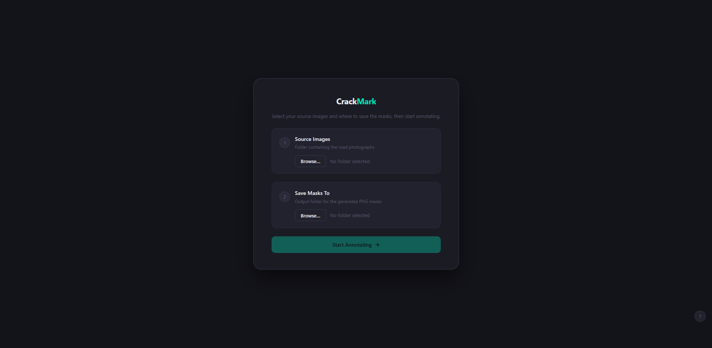
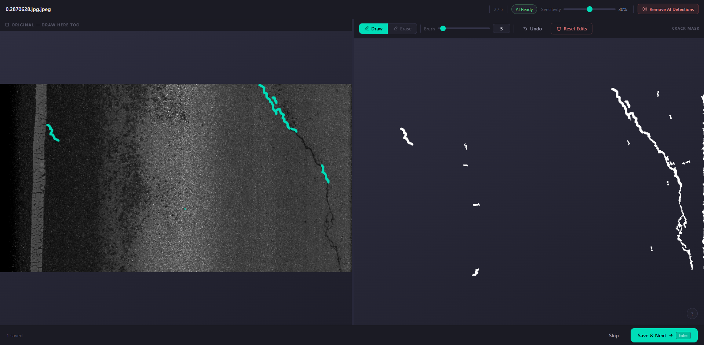

# CrackMark

A road crack detection and annotation tool. You load a folder of road surface photographs, the tool automatically detects cracks in each image and generates a binary mask, and you can then manually refine that mask before saving it. Designed for building labeled datasets for pavement analysis and road condition monitoring.

---

## Screenshots

### Import screen



### Editor with detection



---

## Requirements

- Python 3.8 or newer
- Google Chrome or Microsoft Edge (required for the native folder save feature)

Install the Python dependencies with:

```bash
pip install flask opencv-python numpy scikit-image pillow
```

---

## Getting Started

1. Download or clone the repository
2. Install the dependencies using the command above
3. Run the server with `python server.py`
4. Open `http://localhost:5000` in Chrome or Edge

The terminal will print:

```text
  CrackMark - open http://localhost:5000 in Chrome
```

---

## How to Use

### Step 1 - Select your source images

On the import screen, click **Browse** next to **Source Images**.

A file picker will open. Navigate into the folder that contains your road photographs and click **Select Folder**. The tool will scan for all supported image files inside it and show you a count.

Supported formats: `.png` `.jpg` `.jpeg` `.bmp` `.tiff` `.tif` `.webp`

The images are sorted alphabetically with numeric ordering, so `image2` comes before `image10`.

---

### Step 2 - Select your output folder

Click **Browse** next to **Save Masks To**.

This is the folder where your finished mask PNG files will be saved. You can create a new empty folder here if you want to keep masks separate from your source images.

If your browser does not support the folder picker (older versions, non-Chromium browsers), the tool will fall back to downloading each mask as a file through the browser instead.

---

### Step 3 - Start annotating

Click **Start Annotating**. The tool will load your images one by one into the editor.

---

## The Editor

The editor is split into two panels.

**Left panel** shows the original photograph. You can draw on it here too, and your strokes will mirror across to the mask on the right.

**Right panel** shows the crack mask. White pixels represent detected cracks. Black is background.

A thin draggable bar sits between the two panels. Drag it left or right to resize the panels to your preference.

---

### Detection status chip

The small pill in the header bar shows the current state of the automatic detection:

| Status | Meaning |
| --- | --- |
| Analyzing... | Detection is running on the current image |
| AI Ready | Detection finished, mask is showing |
| No server | `server.py` is not running, work manually |
| AI cleared | You removed the auto detection for this image |

Detection runs automatically when each image loads. It also re-runs any time you move the Sensitivity slider.

---

### Sensitivity slider

Located in the header bar. Range is 10% to 50%. Default is 30%.

**Lower value** picks up more potential cracks, including faint ones. You will get more detections but also more noise and false positives.

**Higher value** only keeps high-confidence detections. Fewer detections overall but cleaner results.

Moving the slider triggers a new detection pass immediately. The previous result is cancelled and replaced.

---

### Drawing on the mask

Use the tools in the right panel toolbar to correct the auto-generated mask.

**Draw mode** paints white onto the mask, adding cracks. When drawing on the left (original) panel in draw mode, a teal overlay shows where you are drawing and the strokes appear as white on the mask simultaneously.

**Erase mode** paints black onto the mask, removing false detections. Works on both panels.

**Brush size** can be set with the slider or by typing a number directly into the number input. Range is 2 to 60 pixels. A circular cursor follows your mouse to show the current brush size.

You can draw on either panel. Drawing on the left panel while in draw mode adds to both the teal overlay (visual reference) and the mask. Drawing directly on the right panel only affects the mask.

---

### Toolbar buttons

**Undo** removes the last stroke you drew. You can undo multiple times, one stroke at a time.

**Reset Edits** removes all your manual strokes and returns the mask to the auto-detection result. A confirmation prompt will appear before anything is deleted.

**Remove AI Detections** (in the header bar) clears the automatic detection entirely. The mask goes black and you can draw everything from scratch manually. Useful when the auto-detection is completely wrong for a particular image.

---

### Saving and moving on

**Save and Next** composites your manual strokes on top of the auto-detection mask and writes the result to your chosen output folder as a PNG file. The file is named after the original image with `_mask` appended, for example `road01_mask.png`. After saving it moves to the next image automatically.

**Skip** moves to the next image without saving anything for the current one.

The header shows your progress as `current / total` and the footer shows how many masks you have saved so far.

When you reach the last image, a completion screen shows the total number of masks saved. You can click **Start Over** to go back to the import screen and begin a new session.

---

## Keyboard Shortcuts

| Key | Action |
| --- | --- |
| `D` | Switch to Draw mode |
| `E` | Switch to Erase mode |
| `Z` | Undo last stroke |
| `Shift + Z` | Reset all edits |
| `[` | Make brush smaller |
| `]` | Make brush larger |
| `Enter` or `Space` | Save and next |
| `S` | Skip image |
| `?` | Toggle shortcut reference panel |

---

## Output format

Each saved mask is a grayscale PNG at the same resolution as the input image.

- **White pixels (255)** represent crack regions
- **Black pixels (0)** represent background

The output is the composite of the auto-detection and all your manual strokes applied in order. Erase strokes paint black over white, draw strokes paint white over black.

---

## Batch processing without the UI

You can run the detection pipeline on a whole folder from the command line without starting the server:

```bash
python crack_segment.py --input "INPUT RAW" --output OUTPUT
```

This processes every image in the input folder and saves a `_crack_mask.png` for each one into the output folder. No manual refinement, just the raw detection output.

Arguments:

| Flag | Default | Description |
| --- | --- | --- |
| `--input` or `-i` | `INPUT RAW` | Folder containing source images |
| `--output` or `-o` | `OUTPUT` | Folder to write mask files into |

---

## How the detection works

Each image goes through the following pipeline:

1. **Load as grayscale** using OpenCV, with Pillow as a fallback for uncommon formats
2. **Denoise** using OpenCV's fast non-local means filter to reduce sensor noise while preserving edges
3. **Remove uneven illumination** by dividing each pixel by a heavily blurred version of the image. This flattens out lighting gradients so the crack detector does not confuse shadows or brightness variation for cracks
4. **Top-hat filtering at two scales** (sigma 8 and sigma 16). A Gaussian top-hat highlights thin dark structures by subtracting the blurred image from itself. Taking the maximum across two scales catches both narrow hairline cracks and wider ones
5. **Suppress bright regions** such as road markings, painted lines, and reflections. Anything brighter than the illumination-corrected threshold gets zeroed out before thresholding
6. **Hysteresis thresholding** with a high threshold at 30% of the image peak and a low threshold at one third of that. Connected regions that touch a high-confidence pixel and are above the low threshold get included. This links up fragmented crack detections
7. **Morphological closing** with a 5-pixel disk to bridge small gaps within a crack region
8. **Fill holes** smaller than 500 pixels inside detected regions
9. **Shape filter** to reject noise and non-crack blobs. Each connected region is evaluated by area, eccentricity (how elongated it is), and solidity (how filled-in the convex hull is). Cracks are long and thin so they have high eccentricity. Blobs that do not meet the minimum shape criteria are discarded

The sensitivity slider in the UI controls the high threshold multiplier in step 6, which is the main dial that determines how aggressively the pipeline detects cracks.

---

## Tech stack

| Layer | Technology |
| --- | --- |
| Detection server | Python, Flask, OpenCV, scikit-image, NumPy |
| Frontend | Vanilla JavaScript, HTML5 Canvas, CSS |
| Image decoding | OpenCV with Pillow fallback |
| Save to disk | File System Access API with download fallback |

No frontend frameworks or bundlers. The entire UI is a single HTML file, one JS file, and one CSS file served directly by Flask.
